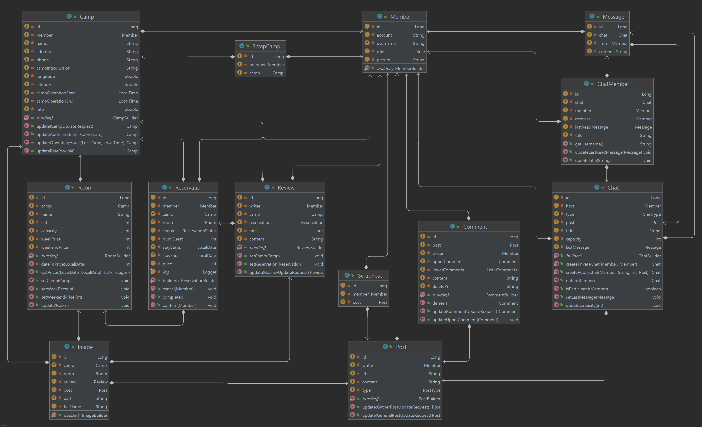

# ⛺감자 캠핑⛺


## 🙋🏻팀 소개

|   |   |   |
|:----------------------------------------------------------------------------:|:----------------------------------------------------------------------------:|:----------------------------------------------------------------------------:|
|                      [김다슬](https://github.com/Daseull)                       |                      [황정아](https://github.com/jaqkqh15)                      |                      [허서영](https://github.com/hs03130)                       |
|                                   Back-end                                   |                                  Front-end                                   |                                   Back-end                                   |


## 👋🏻프로젝트 소개

안녕하세요 Team Potato 입니다.

*감자 캠핑*은 캠핑족을 위한 사이트 입니다.

전국의 **캠핑장 검색과 예약** 그리고 관심사를 공유할 수 있는 **커뮤니티 기능**을 제공합니다.

*감자 캠핑*에서 마음이 맞는 동반자를 찾아 캠핑을 떠나보세요.


## 🚀기술


## 시작 가이드

### Requirements

- Vue.js 2.6.14
- vue/cli 5.0.8
- vuetify 2.6.0


- JAVA 15.0.2
- H2 database
- Oauth : Google, Naver, KaKao
- AWS S3 bucket 생성

### Installation

**Frontend**

**H2**

**Oauth**


**AWS S3**

`backend/src/main/resources/application-aws.properties`
```properties
cloud.aws.s3.bucket={bucket}
cloud.aws.stack.auto=false
cloud.aws.region.static={region.static}
cloud.aws.credentials.access-key={access-key}
cloud.aws.credentials.secret-key={secret-key}
```

## 🖥️화면 구성
((사진추가))
- 메인
- 예약
- 커뮤니티
- 채팅
- 기업 페이지

## 🏁주요 기능
### 캠핑장 검색 및 예약
- 캠핑장 검색
- 캠핑장 예약
- 캠핑장 리뷰 작성

### 캠핑 관련 커뮤니티
- 자유 게시판
- 캠핑 동반자 모집 게시판
- 채팅

### 사업자 관련 기능
- 캠핑장 등록 및 관리
- 예약 관리 및 1:1 채팅

## 🛠️ERD

## 🛠️API Docs
[Gamja Camp API Docs](https://documenter.getpostman.com/view/19596204/2s93m4X319)
